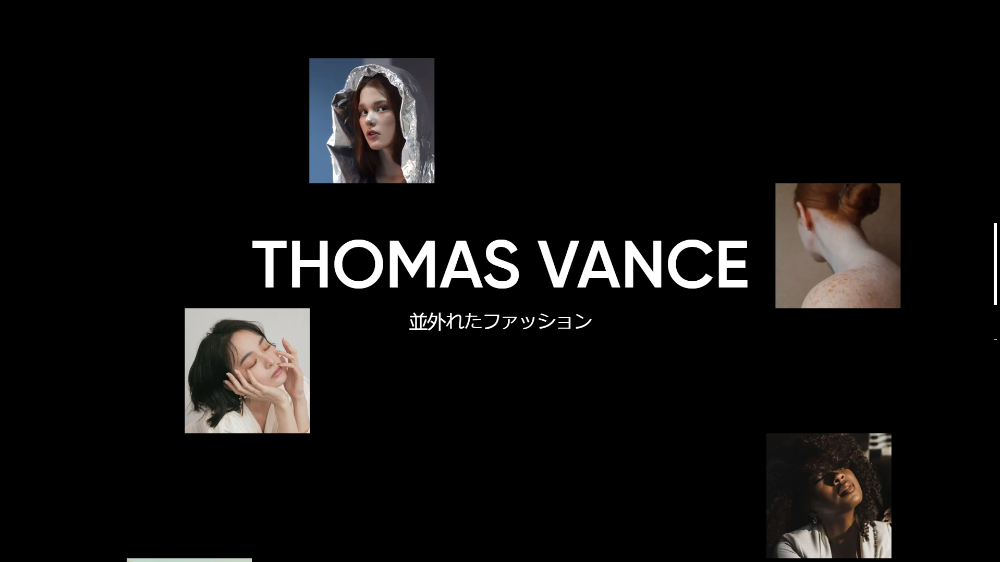

# Thomas Vance - Interactive Portfolio

A modern, interactive demo portfolio website featuring dynamic scroll animations, parallax effects, and smooth scrolling functionality.

## Features

- Smooth Scrolling
- Dynamic Scroll Animations 
- Custom Scroll Progress
- Responsive Design
- Interactive Text Color Animation
  - Words change background color on hover/selection
  - Continuous HSL color transition effect
  - Smooth color interpolation using requestAnimationFrame

The scroll progress indicator was created utilizing Lenis's powerful scroll tracking capabilities, enabling precise control over scroll position and smooth transitions throughout the experience.

## Technologies Used

- GSAP
- Lenis Smooth Scroll
- TailwindCSS
- Vanilla JavaScript

## License

[MIT License](LICENSE)